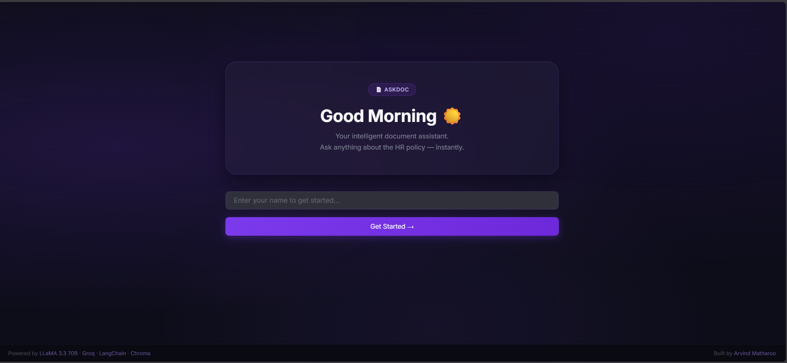
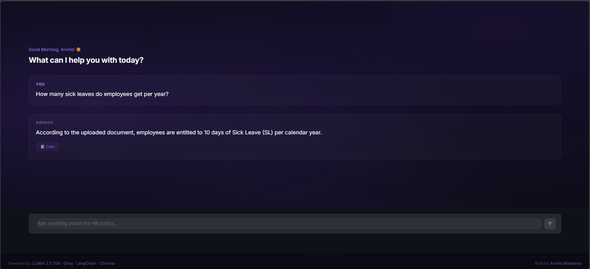

# AskDoc — Conversational RAG Chatbot


<p align="center">
  
  
</p>

AskDoc is a production-quality **Conversational Retrieval-Augmented Generation (RAG)** application that lets users hold multi-turn conversations with any PDF document. It is powered by LLaMA 3.3 70B on Groq, a persistent Chroma vector database, and a premium dark glassmorphism Streamlit interface.

---

## Features

- **Conversational RAG** — full multi-turn chat with memory; follow-up questions are resolved against prior context before retrieval
- **History-Aware Retriever** — standalone question reformulation via LangChain's `create_history_aware_retriever`, so queries like *"Can employees carry it forward?"* are correctly understood without repeating context
- **MMR Retrieval** — Maximal Marginal Relevance (k=4, fetch\_k=30, lambda=0.7) balances relevance and diversity across retrieved chunks
- **Persistent Vector Store** — Chroma DB is built once from the PDF and reloaded on every subsequent run; no re-embedding on restart
- **Premium Glassmorphism UI** — dark theme with violet accent, Claude.ai-style chat layout, animated typing indicator, and copy-to-clipboard on every response
- **Personalised Greeting Screen** — time-based greeting (Morning / Afternoon / Evening / Night Owl) with the user's name
- **Suggested Starter Questions** — empty-state shortcuts to help new users get started immediately
- **Live Sidebar Info Panel** — displays the loaded document, chunk count, full model stack, and live session statistics

---

## Architecture

```
User Query
    |
    v
+--------------------------------------------------+
|           History-Aware Retriever                |
|  Chat History + Query  -->  Standalone Question  |
|  (LLaMA 3.3 70B via Groq)                       |
+---------------------+----------------------------+
                      |
                      | Reformulated standalone query
                      v
+--------------------------------------------------+
|           Chroma Vector DB  (local)              |
|  Embeddings: BAAI/bge-small-en-v1.5             |
|  MMR Search  -->  Top-4 relevant chunks          |
+---------------------+----------------------------+
                      |
                      | Retrieved context
                      v
+--------------------------------------------------+
|           Stuff Documents Chain                  |
|  System Prompt + Context + Chat History          |
|  + Current Query  -->  LLaMA 3.3 70B (Groq)    |
+---------------------+----------------------------+
                      |
                      | Final answer
                      v
             Streamlit Chat Interface
     (RunnableWithMessageHistory manages memory)
```

---

## Tech Stack

| Layer              | Technology                                      |
|--------------------|-------------------------------------------------|
| LLM                | LLaMA 3.3 70B Versatile via Groq API           |
| Embeddings         | `BAAI/bge-small-en-v1.5` (HuggingFace)        |
| Vector Database    | Chroma (local persistent store)                 |
| Retrieval Strategy | MMR — k=4, fetch\_k=30, lambda=0.7             |
| RAG Framework      | LangChain (History-Aware Retriever + Stuff Documents Chain) |
| Memory             | `RunnableWithMessageHistory` + `InMemoryChatMessageHistory` |
| Frontend           | Streamlit — dark glassmorphism, violet accent   |
| PDF Parsing        | `PyPDFLoader` + `RecursiveCharacterTextSplitter` (chunk=500, overlap=150) |

---

## Project Structure

```
askdoc/
├── app.py                    # Main Streamlit application (UI + backend)
├── chatbot_og.ipynb          # Original development notebook
├── TechNova_HR_Policy.pdf    # Sample source document (replace with your own)
├── chroma_db/                # Auto-generated on first run — do not delete
├── .env                      # GROQ_API_KEY lives here (not committed)
├── .gitignore
├── requirements.txt
└── README.md
```

---

## Getting Started

### 1. Clone the Repository

```bash
git clone https://github.com/arvindmatharoo/AskDoc.git
cd askdoc
```

### 2. Create and Activate a Virtual Environment

```bash
python -m venv venv

# Windows
venv\Scripts\activate

# macOS / Linux
source venv/bin/activate
```

### 3. Install Dependencies

```bash
pip install -r requirements.txt
```

### 4. Add Your API Key

Create a `.env` file in the project root:

```env
GROQ_API_KEY=your_groq_api_key_here
```

Get a free API key at [console.groq.com](https://console.groq.com).

### 5. Add Your PDF

Place your PDF in the project root and update the constant at the top of `app.py`:

```python
PDF_PATH = "your_document.pdf"   # line 32
```

The starter questions displayed on the empty chat state are also customisable via the `STARTER_QS` list near the top of `app.py`.

### 6. Run the App

```bash
streamlit run app.py
```

On the first run, AskDoc loads the PDF, splits it into chunks, embeds them using the HuggingFace model, and persists the Chroma vector store to `./chroma_db/`. Every subsequent run loads the existing DB directly — no re-embedding is performed.

> **One-click launcher (Windows):** Create a `run.bat` file in the project root with the following content and double-click it to launch without opening a terminal manually.
>
> ```bat
> @echo off
> call venv\Scripts\activate
> streamlit run app.py
> pause
> ```

---

## Requirements

The core dependencies are listed below. Generate a pinned `requirements.txt` from your active virtual environment using:

```bash
pip freeze > requirements.txt
```

Core packages needed:

```
streamlit
python-dotenv
langchain
langchain-community
langchain-text-splitters
langchain-huggingface
langchain-chroma
langchain-groq
langchain-core
langchain-classic
chromadb
sentence-transformers
pypdf
groq
```

---

## Configuration Reference

All tunable parameters are defined at the top of `app.py` or inside `initialize_backend()`.

| Parameter     | Default                    | Description                                          |
|---------------|----------------------------|------------------------------------------------------|
| `PDF_PATH`    | `TechNova_HR_Policy.pdf`   | Path to the source PDF document                      |
| `DB_PATH`     | `./chroma_db`              | Chroma persistence directory                         |
| `chunk_size`  | `500`                      | Token size per document chunk                        |
| `chunk_overlap` | `150`                    | Overlap between consecutive chunks                   |
| `search_type` | `mmr`                      | Retrieval strategy                                   |
| `k`           | `4`                        | Number of chunks returned per query                  |
| `fetch_k`     | `30`                       | Candidate pool size for MMR selection                |
| `lambda_mult` | `0.7`                      | MMR diversity weight (0 = diverse, 1 = relevant)     |
| `model`       | `llama-3.3-70b-versatile`  | Groq LLM model identifier                            |
| `temperature` | `0`                        | LLM output determinism                               |

---

## UI Walkthrough

**Welcome Screen**

- Time-based personalised greeting rendered from the system clock
- Frosted glass card with name entry field; supports Enter-to-submit via `st.form`
- Full-viewport, no-scroll layout

**Chat Interface**

- Claude.ai-style full-width message layout with `You` and `AskDoc` sender labels
- Animated three-dot typing indicator while the model generates a response
- Copy button on every AI response using the JavaScript Clipboard API; handles multiline markdown correctly
- Suggested starter questions displayed on the first load
- Sidebar showing live document info, model stack details, and session message count
- Clear Chat and Sign Out controls in the sidebar

---

## How RAG with Memory Works

Standard RAG breaks down in conversational settings. After asking *"What is the leave policy?"*, a follow-up like *"Can employees carry it forward?"* contains no standalone meaning — a naive retriever would search for *"carry it forward"* and return irrelevant chunks.

AskDoc solves this with a two-stage pipeline.

**Stage 1 — Question Reformulation**

The history-aware retriever passes the full chat history and the current user query to the LLM. The LLM rewrites the query into a fully self-contained question, for example: *"Can employees carry forward their Earned Leave?"*

**Stage 2 — Retrieval and Answer Generation**

The reformulated question is embedded and used to retrieve the most relevant chunks via MMR. Those chunks are injected into the QA prompt alongside the full chat history, and the LLM generates a grounded, context-bound answer.

`RunnableWithMessageHistory` stores and injects chat history automatically on every invocation.

---

## Document Constraints

The system prompt strictly constrains the LLM to the retrieved context:

- Answers are drawn only from the uploaded document
- No outside knowledge is used under any circumstance
- If the answer is not present in the retrieved context, the model explicitly says so

This makes AskDoc safe to use with confidential internal documents such as HR policies, legal agreements, or technical manuals.

---

## .gitignore

Ensure the following entries are present before your first commit:

```
.env
chroma_db/
venv/
__pycache__/
*.pyc
.DS_Store
```

---

## Author

**Arvind Singh**  
B.Tech Computer Science and Engineering, Punjabi University, Patiala  
* [Github](https://github.com/arvindmatharoo)
* [LinkedIn](https://www.linkedin.com/in/arvindmatharoo/)
---


